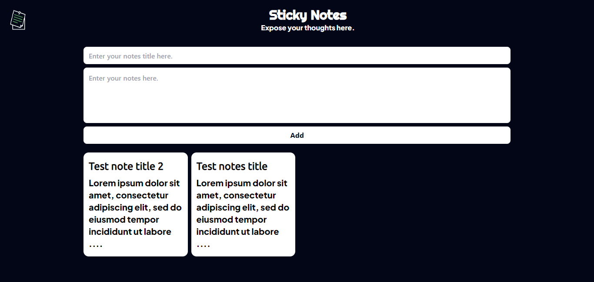
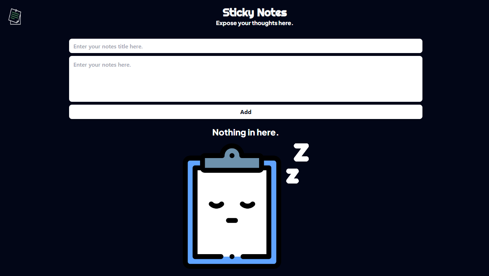

# Sticky Notes

**Project Overview**

**Sticky Notes** is a simple and intuitive sticky notes application built with ReactJS and styled with TailwindCSS. This app allows users to create, edit, and delete notes, providing a straightforward tool for quick note-taking and organization.

## Features

- **Add Notes:** Create new sticky notes with ease.
- **Edit Notes:** Modify the content of existing notes.
 - **Delete Notes:** Remove notes when they are no longer needed.
- **Responsive Design:** Optimized for mobile, tablet, and desktop to ensure a seamless experience on any device.


## Tech Stack

- **ReactJS (VITE):** JavaScript library for building user interfaces.
- **TailwindCSS:** Utility-first CSS framework for styling.

## Screenshots







## Demo

You can view a live demo of the project [here](https://maghrabyy.github.io/sticky-notes/).


## Installation

1. Clone the repository:

```bash
  git clone https://github.com/maghrabyy/sticky-notes.git
```
2. Navigate to the project directory:

```bash
cd sticky-notes
```
3. Install the dependencies:

```bash
npm install
```
 
 4. Start the development server:

 ```bash
 npm start
 ```

 


## Project Structure

The project is organized for easy development and maintenance:

- **/src**
  - **/assets:** Contains images and static files.
  - **/components:** Reusable components for the UI.
## 🚀 About Me

Hello! I’m **Mahmoud Elmaghraby**, a frontend developer with expertise in ReactJS and Material UI. I enjoy creating clean, responsive, and engaging user interfaces, especially for corporate applications. Feel free to connect with me or check out my other work!

- GitHub: [maghrabyy](https://github.com/maghrabyy)
- LinkedIn: [Mahmoud Elmaghraby](https://linkedin.com/in/maghrabyy)


## Contributing

Contributions are welcome! Feel free to submit issues or pull requests to improve the functionality or add new features.


## License
This project is licensed under the [MIT](https://choosealicense.com/licenses/mit/) License.

